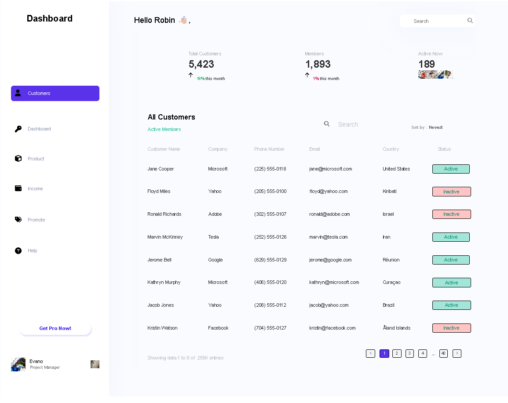

# Dashboard_V1

Dashboard-V1 is a clean, responsive admin dashboard UI built from Figma design references using HTML, CSS, and Font Awesome. It features a modern layout, icon-based navigation, and is optimized for desktop and mobile viewing.

## 📸 Preview

 
> 

## 🚀 Features

- Responsive and modern UI
- Integrated Font Awesome icons
- Clean and semantic HTML structure
- Styled using CSS/Flexbox/Grid
- Optimized for accessibility and performance

## 🧰 Tech Stack

- HTML5
- CSS3
- [Font Awesome](https://fontawesome.com/) for icons
- [Figma](https://figma.com) (used for design reference)

## 📂 Folder Structure

Dashboard_V1/ ├── index.html ├── style.css ├── /img │ ├──│ └── ... │ └──└── README.md

## 📦 Installation

To run the project locally:

1. Clone this repository:

git clone https://github.com/RobinsonAmianda/project-name.git
Navigate to the project folder:

cd Dashboard_V1

🧪 Known Issues
 Mobile responsiveness tweaks

 Add accessibility roles/labels

 Improve search input UX

 📄 License
This project is open source and available under the MIT License.